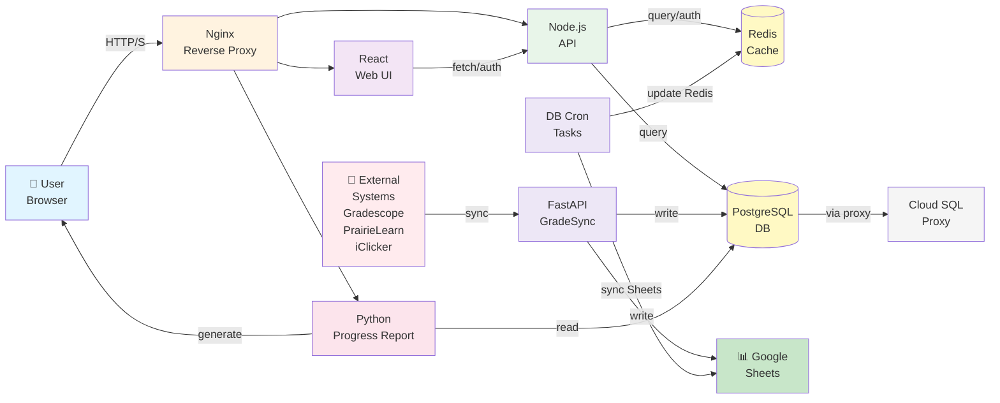

# GradeView Project Structure & Workflow

## Overview

GradeView is a multi-component grade management system consisting of:
- **Frontend**: React Web UI
- **Backend API**: Node.js (data queries, authentication)
- **Grade Sync**: FastAPI GradeSync (pulls grades from external systems)
- **Data Processing**: Python scheduled tasks (dbcron)
- **Report Generation**: Python Progress Report service
- **Infrastructure**: Redis, PostgreSQL, Nginx reverse proxy

---

## Project Directory Breakdown

### 1. **api/** - Node.js API Server

Main responsibilities: user authentication, grade data queries, student information management

```
api/
├── server.js              # Main server entry point
├── Router.js              # Route definitions (versioned routes)
├── config/
│   └── default.json       # API config (Redis, Sheets, OAuth, admin list)
├── lib/
│   ├── authlib.mjs        # Auth middleware (Admin/Student validation)
│   ├── googleAuthHelper.mjs  # Google OAuth token verification
│   ├── userlib.mjs        # User permission checks
│   ├── dbHelper.mjs       # Database connection and queries
│   ├── redisHelper.mjs    # Redis cache operations (student data)
│   ├── studentHelper.mjs  # Student query logic
│   ├── uploadHandler.mjs  # File upload handling
│   └── errors/            # Custom error classes
├── v2/
│   └── index.js           # v2 route implementation
└── uploads/               # Upload file storage
```

**Key workflow:**
1. User login → obtains Google OAuth token
2. API validates token (checks `@berkeley.edu` domain)
3. Queries `config.get('admins')` to determine admin status
4. Returns appropriate data based on permissions

---

### 2. **website/** - React Web UI & Server

Frontend application and static file serving

```
website/
├── server/                # Node.js server (serves static files and proxies)
│   ├── index.js
│   ├── middleware.js
│   └── package.json
├── src/                   # React source code
├── public/                # Static assets
└── build/                 # Compiled frontend (mounted in docker dev)
```

**Responsibilities:**
- Serve React UI interface
- Proxy backend API requests
- Display grades, reports, and other data

---

### 3. **gradesync/** - Grade Sync Service (FastAPI)

Fetches grades from external systems (Gradescope, PrairieLearn, iClicker) and syncs to database and Google Sheets

```
gradesync/
├── config.json           # Course config (enabled systems, Spreadsheet ID)
├── api/
│   ├── app.py           # Main FastAPI application
│   ├── config_manager.py # Config loader
│   ├── schemas.py        # Data models
│   ├── services/         # Business logic layer
│   └── sync/             # Sync logic
├── gradescope/          # Gradescope crawler
│   ├── gradescope_sync.py
│   └── gradescope_to_spreadsheet.py
├── prairieLearn/        # PrairieLearn sync
├── iclicker/            # iClicker sync
└── scripts/             # Helper scripts (backfill, etc.)
```

**Workflow:**
```
External Systems (Gradescope/PL/iClicker)
    ↓
GradeSync crawler/API fetches data
    ↓
Normalize & categorize data (assignment_categories)
    ↓
Update Google Sheets / PostgreSQL
```

---

### 4. **dbcron/** - Database Scheduled Tasks

Python scripts that periodically update Redis cache and refresh database data

```
dbcron/
├── update_db.py         # Update Redis / DB from Sheets
├── update_bins.py       # Update grade bins (score brackets)
├── flush_db.py          # Clear Redis cache
└── manual_update_flush.py # Manual update script
```

**Trigger mechanism:** Cron jobs or scheduled tasks in container

---

### 5. **progressReport/** - Report Generation Service

Python Flask/uWSGI application that generates student progress reports

```
progressReport/
├── app.py              # Main application
├── parser.py          # Data parser
├── templates/         # HTML templates
├── meta/              # Course metadata (grade distributions, etc.)
└── data/              # Report data
```

**Purpose:** Generate visualized reports from grades and provide student feedback

---

### 6. **reverseProxy/** - Nginx Reverse Proxy

```
reverseProxy/
└── default.conf.template  # Nginx config template
```

**Responsibilities:**
- Route requests to Web UI / API / Progress Report
- Configure HTTPS (letsencrypt)
- Load balancing

---

### 7. **scripts/** & **docs/**

- **scripts/setup_cloud_sql.sh** - Cloud SQL Proxy initialization
- **docs/test_db_integration.sh** - Test script
- **docs/demo.html** - Demo page

---

## Data Flow Architecture



---

## 核心工作流

### 1️⃣ 用户登录与权限校验

```
Browser 用户
    ↓
点击登录 (Google OAuth)
    ↓
前端获取 token → 发送给 API
    ↓
API: authlib.mjs validateAdminMiddleware() 或 validateStudentMiddleware()
    ├─ 验证 token (googleAuthHelper.mjs)
    ├─ 检查 @berkeley.edu 域名（如果不是直接拒绝）
    └─ 查询 config.admins 判断 admin 身份 (userlib.mjs)
    ↓
返回数据或 403 权限不足
```

### 2️⃣ 成绩数据同步流程

```
GradeSync 定时任务 / 手动触发
    ↓
根据 gradesync/config.json 配置课程列表
    ↓
对每个课程：
    ├─ Gradescope: 爬虫登录 → 拉成绩 → 整理为标准格式
    ├─ PrairieLearn: API 调用 → 获取分数
    └─ iClicker: 登录 → 同步考勤
    ↓
按 assignment_categories 分类聚合
    ↓
写入 PostgreSQL / Google Sheets
    ↓
dbcron 定时更新 Redis 缓存
```

### 3️⃣ 学生查询成绩流程

```
学生访问页面（已登录）
    ↓
前端 GET /api/student/{email}/grades
    ↓
API 中间件校验（token 和权限）
    ↓
API 查询 Redis → 找到学生缓存数据
    ├─ Hit: 直接返回
    └─ Miss: 查询 PostgreSQL 并写入 Redis
    ↓
前端展示成绩
```

---

## Environment & Configuration

### Environment Variables (`.env`)
- **API**: PORT, DATABASE_URL, SERVICE_ACCOUNT_CREDENTIALS
- **Database**: POSTGRES_HOST, POSTGRES_USER, POSTGRES_PASSWORD
- **GradeSync**: GRADESYNC_SERVICE_ACCOUNT_CREDENTIALS, Gradescope credentials

### Config Files
- **API** (`api/config/default.json`)
  - Redis connection
  - OAuth client ID
  - Admin list
  - Spreadsheet ID

- **GradeSync** (`gradesync/config.json`)
  - Course list
  - Enabled sync sources and credentials
  - Assignment categories mapping

---

## Deployment Topology

### Docker Compose Dev Mode
```
docker compose -f docker-compose.dev.yml up
```
- Web UI (3000)
- API (8000)
- GradeSync (8001)
- Progress Report (8080)
- Redis (6379)
- Cloud SQL Proxy (5432 → Cloud SQL)

### Docker Compose Production Mode
```
docker compose -f docker-compose.yml up
```
- Reverse Proxy (80/443)
- Production DB connection (no Cloud SQL Proxy)

---

## New Team Member Onboarding Checklist

### Step 0: Understand Architecture
- [ ] Read this document
- [ ] Review `docker-compose.dev.yml` to understand service dependencies

### Step 1: Prepare Local Environment
- [ ] Clone repository
- [ ] `cp .env.example .env` and `cp api/config/default.example.json api/config/default.json`
- [ ] Fill in environment variables and config

### Step 2: Start Dev Environment
- [ ] `docker compose -f docker-compose.dev.yml up --build`
- [ ] Verify all services start successfully

### Step 3: Test Authentication & Permissions
- [ ] Login with Berkeley account (need to be added to `api/config/default.json` admins list)
- [ ] Verify student grade query functionality

### Step 4: Modify Code
- [ ] Pick a component to start modifying (e.g., API routes or frontend page)
- [ ] Test your changes

### Step 5: Deploy
- [ ] Merge to main branch
- [ ] CI/CD automatically builds images and deploys

---

## Troubleshooting Guide

| Issue | Root Cause | Solution |
|-------|-----------|----------|
| Login fails (domain mismatch) | Non-Berkeley account used | Only @berkeley.edu accounts allowed |
| 403 permission denied | Account not in admins list | Admin must add your email to `api/config/default.json` |
| Redis connection failed | Redis service not running or address mismatch | Check redis host/port in `api/config/default.json` |
| Gradescope sync fails | Credentials expired or XPath changed | Verify GRADESCOPE_* credentials in `.env` |
| Grades not appearing in Sheets | GradeSync not running or service account lacks permissions | Check GradeSync logs; ensure service account has Sheets edit permission |

---

## Core Files Reference

Files you typically need to modify:

| Requirement | File Location |
|-------------|---------------|
| Modify login logic | `api/lib/authlib.mjs`, `api/lib/googleAuthHelper.mjs` |
| Add new API endpoint | `api/Router.js`, `api/v2/index.js` |
| Modify frontend page | `website/src/**` |
| Change grade sync logic | `gradesync/api/**`, `gradesync/{gradescope,prairieLearn,iclicker}/` |
| Modify database operations | `api/lib/dbHelper.mjs`, `gradesync/api/core/**` |
| Change cache logic | `api/lib/redisHelper.mjs`, `dbcron/*.py` |
| Configure permissions | `api/config/default.json` → `admins` list |
| Configure course sync settings | `gradesync/config.json` |
