# GradeView Docker Architecture

## Container Overview

```mermaid
graph TB
    subgraph "Load Balancer & Proxy"
        RP["🔧 Reverse Proxy<br/>Nginx<br/>Port: 80/443"]
    end
    
    subgraph "Frontend Layer"
        Web["🌐 Web UI<br/>Node.js Server<br/>Port: 3000<br/>Mount: ./website/server"]
    end
    
    subgraph "Application Layer"
        API["🔌 API Server<br/>Node.js/Express<br/>Port: 8000<br/>Mount: ./api"]
        PR["📊 Progress Report<br/>Python/Flask<br/>Port: 5000"]
        GS["⚡ GradeSync<br/>FastAPI<br/>Port: 8000→8001<br/>Mount: ./gradesync"]
    end
    
    subgraph "Cache & Background"
        Redis["💾 Redis<br/>Cache<br/>Port: 6379"]
        Cron["⏰ DB Cron<br/>Python<br/>Mount: ./dbcron"]
    end
    
    subgraph "Data Layer"
        DB["🗄️ PostgreSQL<br/>Port: 5432"]
        CSP["🌐 Cloud SQL Proxy<br/>Port: 5432<br/>→ GCP Cloud SQL"]
    end
    
    subgraph "External Services"
        ES["🔗 External Systems<br/>Gradescope<br/>PrairieLearn<br/>iClicker"]
        GSheets["📈 Google Sheets<br/>API"]
    end
    
    RP --> Web
    RP --> API
    RP --> PR
    
    Web -->|HTTP| API
    API -->|Query| Redis
    API -->|Query| DB
    
    GS -->|Fetch| ES
    GS -->|Write| DB
    GS -->|Write| GSheets
    
    Cron -->|Update| Redis
    Cron -->|Sync| GSheets
    
    DB <-->|TCP Proxy| CSP
    
    PR -->|Read| DB
    
    style RP fill:#fff3e0
    style Web fill:#f3e5f5
    style API fill:#e8f5e9
    style PR fill:#fce4ec
    style GS fill:#ede7f6
    style Redis fill:#fff9c4
    style DB fill:#fff9c4
    style Cron fill:#e0e0e0
    style CSP fill:#f5f5f5
    style ES fill:#ffebee
    style GSheets fill:#c8e6c9
```



---

## Docker Compose Network Topology

### Networks

GradeView uses **3 Docker networks** to isolate services:

```
┌─────────────────────────────────────────────────────────────┐
│                    Docker Host                              │
├────────────────┬───────────────────┬────────────────────────┤
│   frontend     │  db               │  concept_map_integration│
│   Network      │  Network          │  Network               │
├────────────────┼───────────────────┼────────────────────────┤
│ • Reverse Proxy│ • Cloud SQL Proxy │ • Progress Report      │
│ • Web UI       │ • Redis           │                        │
│ • API          │ • DB Cron         │                        │
│ • GradeSync    │ • GradeSync       │                        │
└────────────────┴───────────────────┴────────────────────────┘
```

**Network Details:**

| Network | Purpose | Containers |
|---------|---------|-----------|
| `frontend` | Public-facing services | Reverse Proxy, Web UI, API, GradeSync |
| `db` | Database access | Cloud SQL Proxy, Redis, DB Cron, GradeSync |
| `concept_map_integration` | Optional integration | Progress Report (only in dev) |

---

## Volume Mounts (Dev Mode)

```mermaid
graph LR
    subgraph "Host Machine"
        Code[["📁 Source Code<br/>./api<br/>./website<br/>./gradesync<br/>./dbcron"]]
        Secrets[["🔑 Secrets<br/>./secrets/key.json"]]
        Env[["⚙️ Config<br/>.env<br/>./api/config/"]]
    end
    
    subgraph "Containers"
        APIc["API Container"]
        WebC["Web Container"]
        GSc["GradeSync Container"]
        Cronc["Cron Container"]
    end
    
    Code -->|./api:/api| APIc
    Code -->|./website:/website| WebC
    Code -->|./gradesync:/app| GSc
    Code -->|./dbcron:/dbcron| Cronc
    
    Secrets -->|./secrets:/secrets| APIc
    Secrets -->|./secrets:/secrets:ro| GSc
    
    Env -->|.env| WebC
    Env -->|.env| APIc
    Env -->|.env| GSc
    Env -->|.env| Cronc
    
    style Code fill:#c8e6c9
    style Secrets fill:#ffccbc
    style Env fill:#ffe0b2
    style APIc fill:#e8f5e9
    style WebC fill:#f3e5f5
    style GSc fill:#ede7f6
    style Cronc fill:#e0e0e0
```



**Volume Mount Reference:**

| Container | Source | Mount Point | Mode | Purpose |
|-----------|--------|-------------|------|---------|
| API | `./api` | `/api` | read-write | Live code updates |
| Web | `./website/server` | `/app` | read-write | Serve static files |
| GradeSync | `./gradesync` | `/app` | read-write | Sync scripts |
| DB Cron | `./dbcron` | `/dbcron` | read-write | Cron scripts |
| API | `./secrets/key.json` | `/secrets/key.json` | read-only | GCP auth |
| GradeSync | `./secrets/key.json` | `/secrets/key.json` | read-only | GCP auth |
| API node_modules | (Docker volume) | `/api/node_modules` | - | Prevent override |
| Web node_modules | (Docker volume) | `/website/node_modules` | - | - |

---

## Container Dependency Graph


---

## Environment Variables Path

```
.env (root)
  ├─ API container (env_file: .env)
  │  └─ Read: PORT, SERVICE_ACCOUNT_CREDENTIALS, REDIS_DB_SECRET
  │
  ├─ Web container (env_file: .env)
  │  └─ Read: REACT_APP_PROXY_SERVER, REACT_APP_PORT
  │
  ├─ GradeSync container (env_file: .env)
  │  └─ Read: GRADESYNC_SERVICE_ACCOUNT_CREDENTIALS
  │            GRADESYNC_DATABASE_URL, POSTGRES_*
  │
  ├─ DB Cron container (env_file: .env)
  │  └─ Read: REDIS_URL, SPREADSHEET_*
  │
  └─ Reverse Proxy (environment)
     └─ Read: REVERSE_PROXY_LISTEN (dev only)
```

---

## Port Mapping

### Dev Mode (docker-compose.dev.yml)

```
Host (Your Machine)          Container
────────────────────────────────────────
    80 ─────────────────→   80  (Reverse Proxy)
   443 ─────────────────→  443  (Reverse Proxy)
  3000 ─────────────────→ 3000  (Web UI)
  8000 ─────────────────→ 8000  (API)
  8001 ─────────────────→ 8000  (GradeSync)
  8080 ─────────────────→ 5000  (Progress Report)
  6379 ─────────────────→ 6379  (Redis)
```

**Internal Container Network (no host exposure):**
- API ↔ Redis (6379)
- API ↔ Cloud SQL Proxy (5432)
- GradeSync ↔ Cloud SQL Proxy (5432)
- DB Cron ↔ Redis (6379)
- Progress Report ↔ Cloud SQL Proxy (5432)

### Production Mode (docker-compose.yml)

```
Host (Load Balancer)         Container
────────────────────────────────────────
    80 ─────────────────→   80  (Reverse Proxy)
   443 ─────────────────→  443  (Reverse Proxy)

(All other ports NOT exposed)
- Internal: Web, API, GradeSync communicate via internal network
```

---

## Build & Runtime Flow

### Image Building


---

## Service Startup Order

### Dev Mode (docker-compose.dev.yml)

```
1. cloud-sql-proxy
   ↓
2. Redis
   ↓
3. ┌─ API
   ├─ Web
   ├─ GradeSync
   ├─ Progress Report
   └─ DB Cron
   ↓
4. Reverse Proxy (depends_on: web, api, dtgui-progress-report)
```

**Startup time ~30-60s** (first build may take longer)

---

## Healthchecks & Logs

### Check Service Status

```bash
# List running containers
docker compose -f docker-compose.dev.yml ps

# View logs for specific service
docker compose -f docker-compose.dev.yml logs api
docker compose -f docker-compose.dev.yml logs gradesync
docker compose -f docker-compose.dev.yml logs -f redis  # Follow

# Interactive shell in container
docker compose -f docker-compose.dev.yml exec api /bin/sh
```

### Common Port Checks

```bash
# Check if API is responding
curl http://localhost:8000/health

# Check if Web UI is up
curl http://localhost:3000

# Test Redis connection
redis-cli -h localhost -p 6379 ping
```

---

## Storage & Persistence

### Data Persistence (Dev Mode)

| Data | Storage | Persistent | Notes |
|------|---------|-----------|-------|
| Redis data | In-memory | ❌ Lost on restart | Cache only |
| PostgreSQL | Cloud SQL (GCP) | ✅ Persistent | Remote DB |
| Uploads | `./api/uploads/` | ✅ Volume mount | Host directory |
| Node modules | Docker volume | ✅ Cached | Speed optimization |

### Data Persistence (Production Mode)

| Data | Storage | Persistent | Notes |
|------|---------|-----------|-------|
| Redis data | In-memory | ❌ Lost on restart | Cache only |
| PostgreSQL | Remote Cloud SQL | ✅ Persistent | GCP managed |
| Uploads | Persistent volume | ✅ Persistent | Cloud storage |

---

## Troubleshooting Docker Issues

### Container won't start

```bash
# Check logs
docker compose logs <service-name>

# Common issues:
# - Port already in use: Check "Port mapping" section
# - Missing env vars: See ".env.example"
# - Volume mount error: Check permissions on ./api, ./website, etc.
```

### Network connectivity issues

```bash
# Test DNS resolution in container
docker compose exec api nslookup redis

# Test port accessibility
docker compose exec api curl -i http://redis:6379

# View network details
docker network ls
docker network inspect <network-name>
```

### Rebuild everything from scratch

```bash
# Stop all containers
docker compose -f docker-compose.dev.yml down

# Remove volumes (WARNING: deletes data!)
docker compose -f docker-compose.dev.yml down -v

# Rebuild images
docker compose -f docker-compose.dev.yml up --build
```

---

## Performance Optimization

### Build Optimization

1. **Layer Caching**: Dockerfile stages are cached if source unchanged
2. **Node Modules**: Separate volume to avoid reinstall on code changes
3. **Build Context**: `.dockerignore` excludes large files (node_modules, .git)

### Runtime Optimization

1. **Resource Limits** (optional in compose):
   ```yaml
   resources:
     limits:
       cpus: '0.5'
       memory: 512M
   ```

2. **Logging**: Redirect logs to avoid disk bloat
   ```yaml
   logging:
     driver: "json-file"
     options:
       max-size: "10m"
       max-file: "3"
   ```

---

## Quick Reference

### Start Development Environment
```bash
cp .env.example .env
cp api/config/default.example.json api/config/default.json
docker compose -f docker-compose.dev.yml up --build
```

### Start Production Environment
```bash
cp .env.example .env
cp api/config/default.example.json api/config/default.json
docker compose -f docker-compose.yml up --build
```

### View Logs
```bash
# All services
docker compose logs -f

# Single service
docker compose logs -f api

# Last 100 lines
docker compose logs --tail 100 api
```

### Execute Commands in Container
```bash
# Run Python script in gradesync
docker compose exec gradesync python api/app.py

# Check node version in API
docker compose exec api node --version

# Access Redis CLI
docker compose exec redis redis-cli
```
