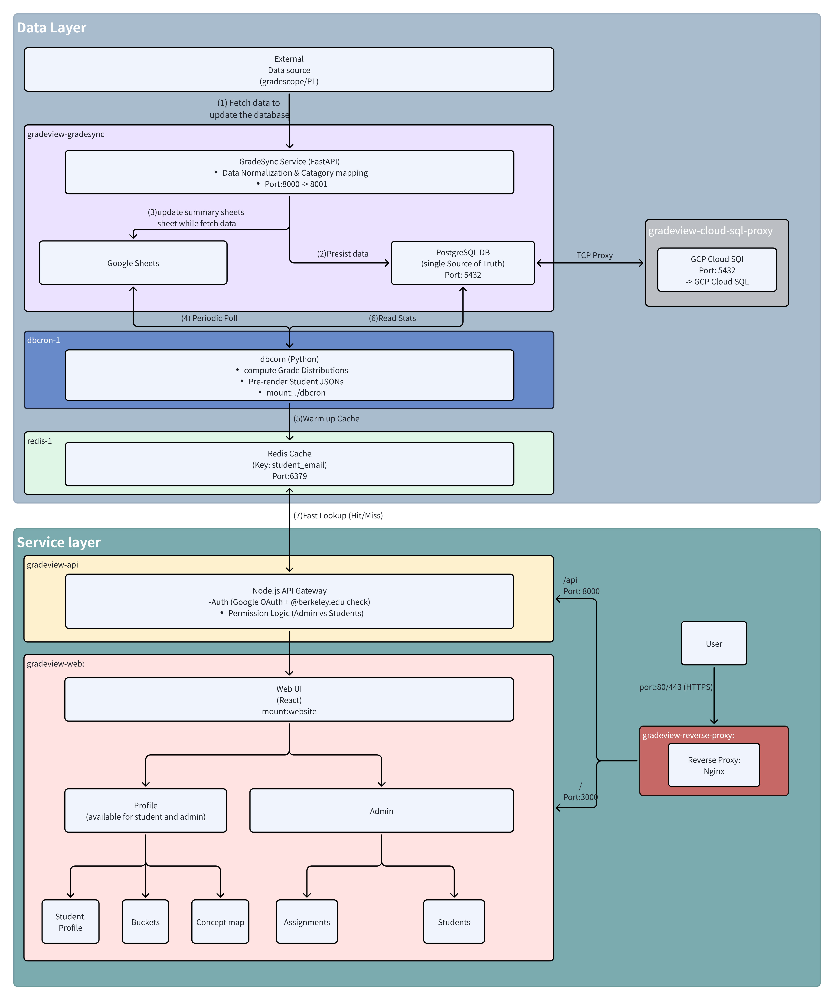

# GradeView

GradeView is a multi-service web app for viewing grades, syncing data, and generating reports. It includes a React web UI, a Node.js API, background sync jobs, a Python-based progress report service, and supporting services like Redis and Cloud SQL Proxy.

## High-level architecture



## Project structure

```
Grades/
  api/                # Node.js API
  website/            # React web UI and server
  gradesync/           # Grade sync service (FastAPI)
  progressReport/     # Progress report service
  reverseProxy/       # Nginx reverse proxy
  dbcron/             # Cron jobs and DB maintenance scripts
  docs/               # Docs and helper scripts
  scripts/            # Utility scripts
  secrets/            # Local secrets (not committed)
  docker-compose.yml  # Production-like compose
  docker-compose.dev.yml # Dev compose with Cloud SQL Proxy
  .env.example        # Environment template
  api/config/default.example.json # API config template
  gradesync/config.example.json # GradeSync config template
```

## Key services

- **Web UI**: React app served by the web container.
- **API**: Node.js server for authentication and grade data access.
- **GradeSync**: FastAPI service to sync grades from external sources.
- **Progress Report**: Python service for report generation.
- **Redis**: Cache and student data lookup.
- **Cloud SQL Proxy** (dev compose): Connects to a Cloud SQL instance.

## Authentication notes

- Only `@berkeley.edu` accounts can authenticate (enforced by Google token domain check).
- Admins are defined in `api/config/default.json` under `admins`.

## Configuration

1. Copy the environment template:
   ```bash
   cp .env.example .env
   ```
2. Copy the API config template:
  ```bash
  cp api/config/default.example.json api/config/default.json
  ```
3. Copy the GradeSync config template:
  ```bash
  cp gradesync/config.example.json gradesync/config.json
  ```
4. Fill in required values in `.env`:
   - `SERVICE_ACCOUNT_CREDENTIALS` and `GRADESYNC_SERVICE_ACCOUNT_CREDENTIALS`
   - Database connection (`GRADESYNC_DATABASE_URL` or `POSTGRES_*`)
   - Spreadsheet settings and third-party credentials
5. Fill in required values in `api/config/default.json`:
  - `redis`: Redis connection for API
  - `spreadsheet`: Google Sheets ID and layout used by the API
  - `googleconfig.oauth.clientid`: OAuth client ID used to verify tokens
  - `admins`: list of admin emails
6. Fill in required values in `gradesync/config.json`:
  - `courses`: course metadata and source system settings
  - `spreadsheet`: target spreadsheet per course
  - `database`: whether to sync to DB and use it as primary
  - `assignment_categories`: mapping patterns for category rollups
  - `global_settings`: default scopes and retry/log settings
7. If using the dev compose with Cloud SQL Proxy:
   - Place your Google service account key at `secrets/key.json`.
   - Set `INSTANCE_CONNECTION_NAME` in `.env`.

## Running with Docker

- Development-like stack:
  ```bash
  docker compose -f docker-compose.dev.yml up --build
  ```

- Production-like stack:
  ```bash
  docker compose -f docker-compose.yml up --build
  ```

## Common ports

- Web UI: 3000
- API: 8000
- Progress Report: 8080

## Troubleshooting

- If login fails, confirm the account is `@berkeley.edu` and listed in `admins` (for admin routes).
- If GradeSync cannot access sheets, verify the service account has access to the target spreadsheet.
- For DB connection issues, confirm Cloud SQL Proxy settings and `POSTGRES_*` values.
